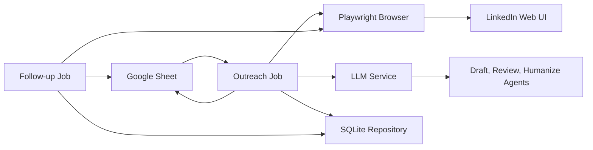

# Architecture

## Design Decisions

The system is split into small services with explicit boundaries: Sheets ingestion, browser automation, LLM orchestration, local state, scheduling, and logging. Runtime settings come from `.env` plus `config/config.yaml`, so secrets and behavior are not hardcoded.

The LinkedIn UI is intentionally selector-driven through YAML. LinkedIn changes markup often, and moving selectors out of code makes maintenance safer.

## Component Interactions



## Data Flow

1. `SheetService` reads eligible rows.
2. `SQLiteRepository` creates a run and upserts the profile.
3. `BrowserManager` opens a persistent Chromium profile.
4. `LinkedInService` extracts visible context and recent posts.
5. `CommentGenerator` drafts a comment.
6. `ReviewAgent` reviews the comment.
7. `NoteGenerator` drafts a connection note.
8. `ReviewAgent` reviews the note.
9. `HumanizationAgent` applies small wording jitter and length enforcement.
10. `LinkedInService` performs the configured browser actions.
11. `SheetService` and `SQLiteRepository` persist the result.

## State Management

SQLite stores:

- `runs`: outreach and follow-up executions.
- `profiles`: LinkedIn URLs, sheet rows, extracted context, and current status.
- `messages`: draft, reviewed, and final note/comment text.
- `actions`: likes, comments, connection requests, detection, withdrawals, and failures.
- `followups`: pending, accepted, and withdrawn connection lifecycle state.

The repository pattern keeps SQL out of job orchestration code.

## Scheduling Design

`SchedulerService` wraps APScheduler and accepts cron strings from YAML:

- Outreach default: weekdays at 09:00.
- Follow-up default: daily at 10:00.

The included CLI jobs are also runnable directly for local control and testing.

## Browser Automation Design

Playwright uses a persistent browser profile so manual LinkedIn login can be reused. The automation applies randomized viewport dimensions, mouse movement, scrolling, idle pauses, click delays, and typing delays. These features are intended to reduce brittle robotic behavior and make runs easier to observe, not to promise evasion.

Failure handling captures screenshots and records errors in both SQLite and Google Sheets.

## LLM Orchestration

`LLMService` abstracts providers:

- OpenRouter via OpenAI-compatible chat completions.
- OpenAI via chat completions.
- Anthropic via Messages API.

The generation pipeline is:

```text
Draft -> Review -> Humanize -> Validate -> Persist -> Browser action
```

Validation checks length, tone, sales/spam wording, and whether the note uses available profile context.

## Failure Handling

The project uses:

- Exponential backoff for network LLM calls.
- Configurable fallback selectors.
- Per-profile exception handling.
- Screenshot capture on failure.
- Structured JSON logs.
- Graceful shutdown in the outreach job.
- Persistent browser context recovery across runs.

## Security Considerations

Secrets belong in `.env` or local service account files that are never committed. The `.env.example` file contains only empty values. Browser session state is stored locally under `.browser/` and `.auth/`; protect these directories because they may contain authenticated session data.

Set `DRY_RUN=true` while validating configuration. Keep rate limits conservative and confirm that your use complies with LinkedIn policies and applicable laws.
